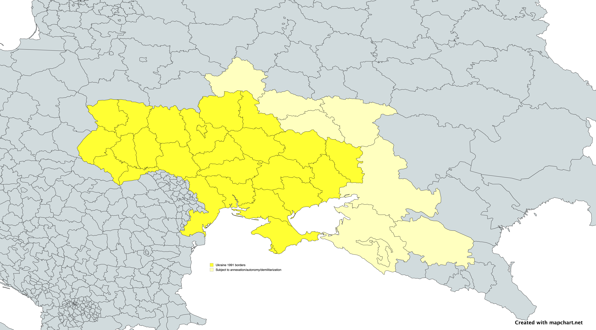

# TERMS OF ARMISTICE SIGNED BY RUSSIA

## Article 1. Cessation of all hostilities

Cessation of all operations by land, in the sea, and in the air six hours after the signature of the armistice must take
place. This also includes any and all forms of paramilitary operations.

The Parties commit to and declare an immediate and Permanent Cessation of hostilities and all subsequent stages of the
peace process.

This Permanent Cessation of all forms of hostilities shall include, among others; the cessation of overt and covert acts
of violence; laying of mines; sabotage; airstrikes; direct or indirect acts of violence; and subversion or use of proxies
to destabilize the other Party or collusion with any external force hostile to either Party.

This Permanent Cessation of hostilities shall include the cessation of all forms of propaganda, rhetoric, and hate speech.

Also, all military, para-military operations as well as any law enforcement and disaster operations by members of the
armed forces are to be ceased definitely in the regions and territories which are to be indicated and described in
Article 3 of this document by the Parties involved, with only law enforcement and emergency organizations continuing to
function in the period following the cessation of hostilities in these areas.

## Article 2. Withdrawal of the Russian troops

TODO

## Article 3. Territorial integrity of Ukraine

Regarding the territorial integrity of the nation and its independence, aligned more than ever before in the history of
the land with the nations of the Free Western World, Ukraine must therefore, with Western assistance, fulfill the behest
of the late Mykhailo Hrushevsky, one of the first to fight for the independence of Ukraine from Russian domination, and
thus consider not just the restoration of the legally defined borders it had at the restoration of independence in 1991,
Crimea (1) and the Donbass inclusive, but given the history and cultures of the Ukrainian people at large, the great
Ukrainian victories won by its Armed Forces and wartime auxilary organizations in Kursk Oblast (2) against Russia and its
allies beginning in the summer of 2024 now slowly cementing in the minds of Ukrainians and all the people of the free
world its rightful place as part of the territory of said nation, and the wishes of the former Kuban People's Republic
in 1919 to unify it with the Ukrainian nation completing thus the wishes of Hrushevsky and others to unify all the lands
wherein the Cossack people have been present throught history, the demand thus of many within Ukraine to unite all these
areas, including those of the historic Kuban, to the Ukrainian nation, to consider formally officially acknowledge that
Bilhorod (3), Kursk, Bryansk (4), Voronesk (5) and Rostov Oblasts (6), Krasnodar Krai (7) and Stavropol Krai (8), and the Republic of Adygea (9),
all territories of the so-called Russian Federation, and all these being for many years, until the Holomodor of the
1930s and beyond, the lands in which millions of Ukrainians lived and worked outside of the current borders of Ukraine
as constituted by law, and given that these lands have been where the storied cultures and heroism of the Cossack nation
have bore witness over the centuries, as territories of the Ukrainian nation in name and in deed, as officially part of
the administrative organization of the Ukrainian nation and organized in accordance with the Constitution and relevant
decrees of the Presidency of the Republic and legislative acts of the Supreme Council/Verkhovna Rada of Ukraine
regarding their administrative divisions, in which the fate of all Russian owned and operated public and private
businesses, public and privately owned utilities, and the Russian Orthodox Church and all other religious denominations
operating in these regions, and others, shall be determined by relevant legislation of the Supreme Council/Verkhovna
Rada, in which the Ukrainian language shall officially be granted the status of principal language to be used in these
territories in line with its official sanction as the national language, and that relevant units and organs of the
national governent, Armed Forces, MVS, National Police and other state organizations be officially begin operating in
said regions and territories and must also recruit personnel to these organizations from the local population. Upon
formal annexation, there must be an all-out effort to remove all the former symbols of the rule of the so-called
"Russian Federation" and its predecessor states, as well as the Russian language itself, within said territories, and
also recognition of the Ukrainian presence in these territories and the suffering of Ukrainians in the aformentioned
thru the era of Russian occupation. Members of the Armed Forces of Russia and the law enforcement organs of the Russian
Federation within these territories must be urged to swear an oath of allegance to Ukraine and accept Ukrainian
sovereignity in these territories, and those within these organizations that have committed war crimes and human rights
abuses against Ukrainians and the local population within the war will be punished accordingly. Any and all Russian
politicial parties and organizations operating in these territories will be banned and ceased to exist altogether in
these territories and shall be replaced by the political parties and organizations recognized by Ukraine and operating
in its territory.

In addition, given the Ukrainian recognition of the historic Circassian Genocide during the era of the Russian Empire,
and in gratitude for the service rendered by the Circassian fighters who have fought against Russia in its illegal war
against Ukraine and in retaliation for the destruction of their homelands, culture and traditions by the Russian Empire
and its successors, Adygea will, as an Autonomous Republic of Ukraine upon its official annexation, be granted full
autonomy in accordance with the Constitition and relevant laws of Ukraine, especially in cultural, economic and social
affairs, while foreign and defense affairs shall be the purview of the national government in Kyiv, with the Adyghe
language given the status of regional official language and efforts made to restore the traditional cultural, social and
religious expressions of the Circassians of Adygea and their surrounding regions that were destroyed by the forces of
Imperial Russia, so that, living together in harmony with their fellow Ukrainians and the peoples of the free Western
World, and standing shoulder to shoulder as peoples oppressed by Russia throughout the times and history, having now
restored its standing and the way of life that suffered so much under Russian rule, they will now consider themselves
truly free under the protection of the wider Ukrainian nation and the wider umbrella of the Western World and its armed
forces. In gratitude for the historical struggle of the Circassian people against Russia over the centuries, the
Circassians of Adygea should be encouraged, especially after official annexation, to consider joining the ranks of the
Armed Forces of Ukraine and the law enforcement, security and emergency organizations of the Ukrainian nation,
exercising thus obedience to the norms of the Constitution and laws of Ukraine and to the duly constituted authorities
of the nation, and their commitment to contribute to the security and defense of the nation at large and cooperating
with the Western Powers towards the goal of a brighter future and prosperous society finally free from the years of
suffering and persecution incurred at the hands of the Russian occupier.

In addition, upon the official retrocession of Crimea as constituent Autonomous Republic of Ukraine, the Crimean Tatar
language shall be fully restored and education in it made mandatory alongside the Ukrainian language, and efforts made
to restore the cultures and traditions of the Crimean Tatar population in Ukraine that have suffered so much under
Russian rule over the centures, and especially since the annexation by Russia once more of the peninsula in 2014 by
force of an illegal referendum. Names of places in this region will be now in the Crimean Tatar language, especially in
the original place names that were later replaced by those in the Russian language, and every representation of Russia
and its precesssors will be treated on a case to case basis. The Crimean Tatar population must also be encouraged to
join the Armed Forces of Ukraine and the law enforcement, security and emergency organizations in the manner prescribed
by law.

Much of Luhansk and Donetsk Oblasts, which were taken away from Ukraine to form so-called proxy republics by the
assistance of the Armed Forces of Russia and its paramilitaries and its allies and supporters in Ukraine, will be
returned to Ukraine and all those Russians and Ukrainians who helped in the secession of much of the territory of these
oblasts from Ukraine will be punished, as well as any who have served in the Armed Forces and law enforcement organs in
these terriories (formerly the armed forces and law enforcement organizations of the so-called Donetsk and Luhansk
People's Republics sponsored by Russia and illegially annexed into it by false referendum in 2022).

The autonomous republics of Kabardino-Balkaria and Karachay-Cherkessia, also a part of the "Russian Federation", will be
assisted by Ukraine to help in their liberation from the Russian dominator and autocrat, and will be assisted in either
preparing for full annexation as republics of Ukraine owing to their location as part of the historic Kuban, or to
become fully independent nations, in either case Ukraine will contribite to helping for the restoration of their
languages and the Circassian cultures and traditions in these territories suppressed and persecuted by Russia over the
centuries.

Source data: [Ukraine_and_bordering_oblasts.txt](data/Ukraine_and_bordering_oblasts.txt) with [MapChart](https://www.mapchart.net/europe-detailed.html)

## Article 4. Return of POWs and bodies

TODO

## Article 5. Return of civilians incl. kidnapped children

TODO

## Article 6. War criminals to Hague

TODO

### Leaderdship on government level

- Vladimir Putin - President
- Dmitry Medvedev - Prime Minister
- Sergey Lavrov - Minister of Foreign Affairs

### Leadership on military level

- Valery Gerasimov - Chief of the General Staff
- Sergey Shoygu - Minister of Defense
- Igor Kostyukov - Chief of the GRU

### Commanders of the Armed Forces

- TODO

### Lower level commanders

- TODO

### Identified soldiers commiting war crimes

- TODO

## Article 7. War reparations (from Russia to Ukraine)

### Destroyed infrastructure

- TODO

### Lost lives

- TODO

## Article 8. Terms for Russia for easing sanctions

No sactions are to be eased until the full implementation of the terms of this armistice.

### 1st stage of easing sanctions

- Any items related to living of normal citizens, such as food, medicine, and other basic necessities, will be allowedto be imported to Russia.

## Article 9. Conditions in the Black Sea and Azov Sea

### Black Sea

- TODO

### Azov Sea

- TODO

## Annexes

TODO
